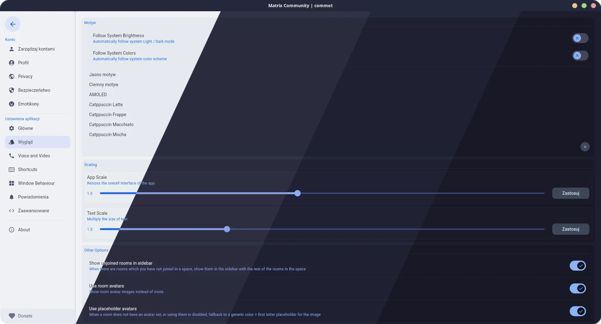
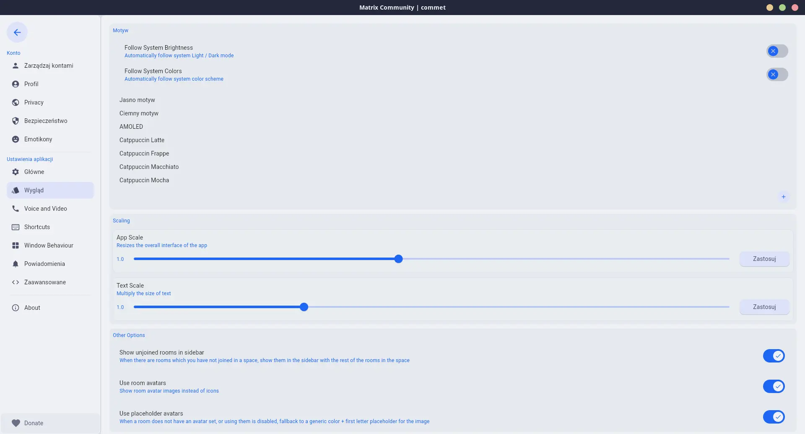
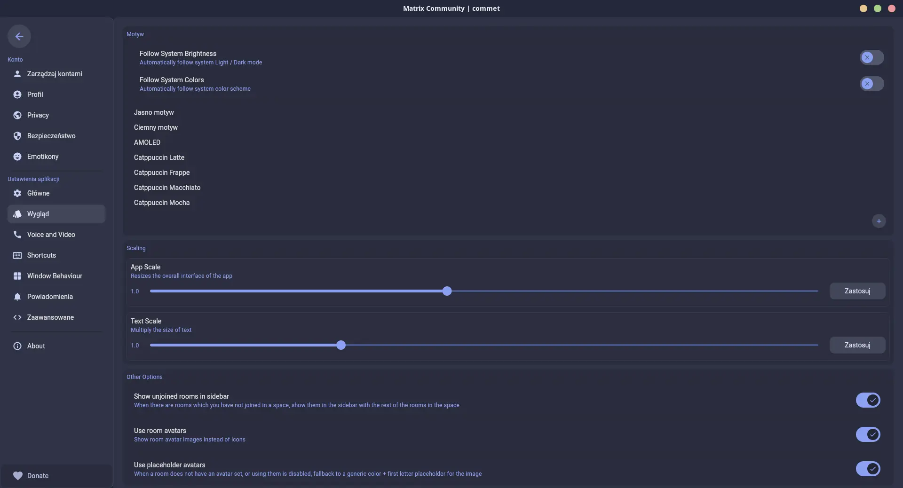
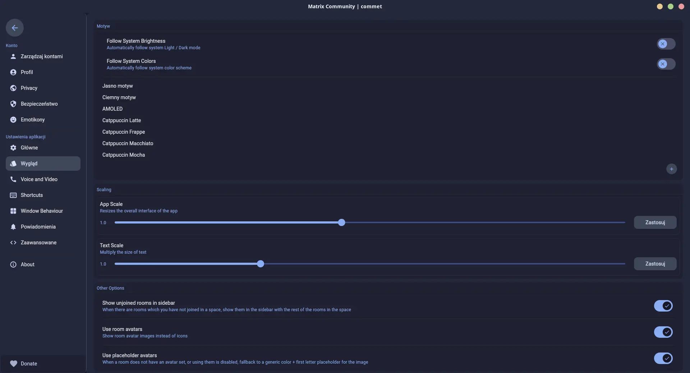
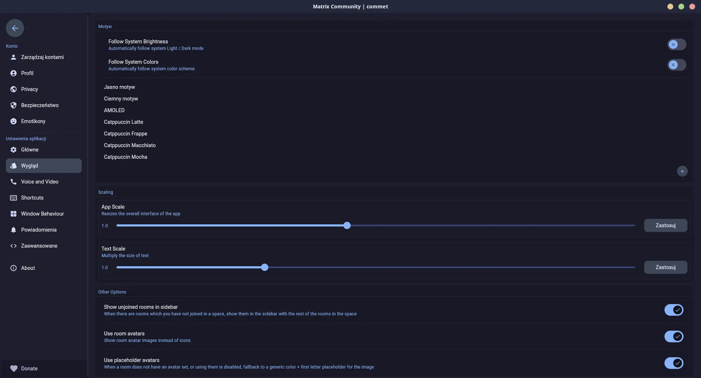

<h3 align="center">
	 
	
	Catppuccin for <a href="https://github.com/commetchat/commet">Commetchat</a>
	
</h3>

	
	
	

	

## Previews

🌻 Latte

🪴 Frappé

🌺 Macchiato

🌿 Mocha

## Usage

1. Download the `theme.json` file for your preferred flavor.
2. Open `theme.json` in a text editor.
3. Replace every `ACCENT_HEX` placeholder with your preferred accent color from the [FAQ table](#-faq).
4. Create a ZIP archive containing the edited `theme.json` (for example, `Catppuccin Mocha.zip`).
5. Open Commet, then go to **Settings** > **Appearance** > **Themes** and click **+**.
6. Select your ZIP archive, then choose the imported theme.

<!-- The FAQ section is optional. Remove if needed.-->
## 🙋 FAQ

- Q: **_"What accent colors can I use?"_**\
	A: Any Catppuccin accent color from the table below.

| Accent | Latte | Frappe | Macchiato | Mocha |
| --- | --- | --- | --- | --- |
| Rosewater | `#DC8A78` | `#F2D5CF` | `#F4DBD6` | `#F5E0DC` |
| Flamingo | `#DD7878` | `#EEBEBE` | `#F0C6C6` | `#F2CDCD` |
| Pink | `#EA76CB` | `#F4B8E4` | `#F5BDE6` | `#F5C2E7` |
| Mauve | `#8839EF` | `#CA9EE6` | `#C6A0F6` | `#CBA6F7` |
| Red | `#D20F39` | `#E78284` | `#ED8796` | `#F38BA8` |
| Maroon | `#E64553` | `#EA999C` | `#EE99A0` | `#EBA0AC` |
| Peach | `#FE640B` | `#EF9F76` | `#F5A97F` | `#FAB387` |
| Yellow | `#DF8E1D` | `#E5C890` | `#EED49F` | `#F9E2AF` |
| Green | `#40A02B` | `#A6D189` | `#A6DA95` | `#A6E3A1` |
| Teal | `#179299` | `#81C8BE` | `#8BD5CA` | `#94E2D5` |
| Sky | `#04A5E5` | `#99D1DB` | `#91D7E3` | `#89DCEB` |
| Sapphire | `#209FB5` | `#85C1DC` | `#7DC4E4` | `#74C7EC` |
| Blue | `#1E66F5` | `#8CAAEE` | `#8AADF4` | `#89B4FA` |
| Lavender | `#7287FD` | `#BABBF1` | `#B7BDF8` | `#B4BEFE` |

## 💝 Thanks to

- [Andus](https://github.com/AndusDEV)

&nbsp;

	

	Copyright &copy; 2021-present <a href="https://github.com/catppuccin" target="_blank">Catppuccin Org</a>

	

